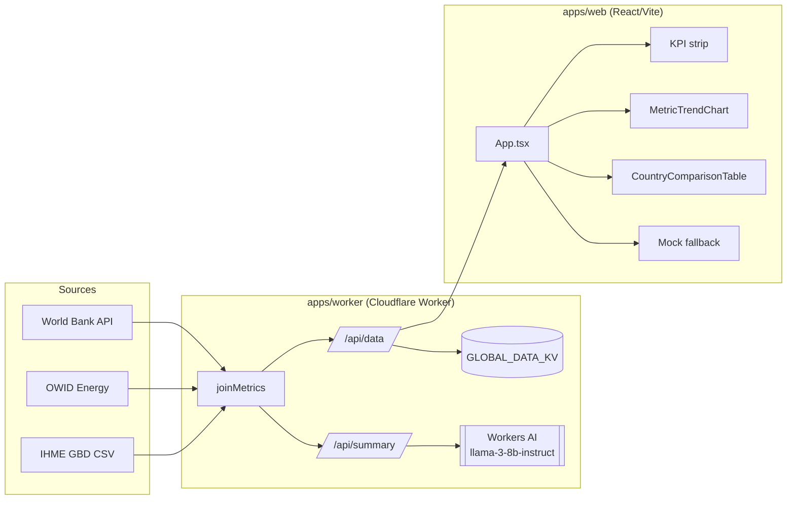

# Architecture Status

Last updated: 2026-08-23

This document describes how the Global Intelligence Analytics Dashboard is structured and how data flows through the system.

## High-Level Overview

The project is an npm-workspaces monorepo with two apps and local data scripts:

```
apps/web      → React + TypeScript + Vite frontend (dashboard UI)
apps/worker   → Cloudflare Worker (data API + AI summaries)
data/         → raw samples and processed artifacts
scripts/      → sample fetchers and data preparation
```



## Data Flow

1. **Ingestion (Worker)** — `apps/worker/src/sources/` fetches upstream data:
   - `worldBank.ts` pulls indicators via the World Bank API (`GC.TAX.TOTL.GD.ZS` for tax revenue, plus GDP, population, Gini, internet, urban population, life expectancy).
   - `owid.ts` pulls energy series.
   - IHME DALY rates come from a preprocessed artifact (`data/processed/ihme/health.json`, generated by `scripts/prepare-ihme.mjs` from authorized CSV exports).
2. **Join** — `apps/worker/src/data.ts` (`joinMetrics`) merges all sources into one `GlobalEntityMetric` record per ISO3 country code + year, with light year-over-year simulation so historical ranges render plausibly.
3. **API + cache** — `apps/worker/src/index.ts` serves:
   - `GET /api/data?iso3&startYear&endYear` → time series for one country. Responses are cached in KV (`GLOBAL_DATA_KV`) with a 24-hour TTL, keyed `data:{iso3}:{start}:{end}`.
   - `GET /api/summary?iso3&year` → a 3-sentence narrative generated by Workers AI, cached under `summary:{iso3}:{year}`.
   - All responses include permissive CORS headers for local dev.
4. **Frontend** — `apps/web/src/App.tsx` fetches `/api/data` for the selected country and, in parallel, for each comparison country. If the Worker is unreachable (e.g. only the Vite server is running), it falls back to `generateMockData` so the UI always renders.
5. **Shared schema** — `GlobalEntityMetric` is defined identically in `apps/web/src/types.ts` and `apps/worker/src/types.ts` so both sides agree on fields.

## Frontend Structure

| Piece | File | Role |
| --- | --- | --- |
| App shell | [apps/web/src/App.tsx](apps/web/src/App.tsx) | State (country, year range, comparison set, active tab), data loading, KPI averaging, tab layout |
| Header | [apps/web/src/components/Header.tsx](apps/web/src/components/Header.tsx) | Static title + subtle two-dropdown year filter |
| KPI strip | [apps/web/src/components/KpiCard.tsx](apps/web/src/components/KpiCard.tsx) | Compact cross-country average cards (10 categories), horizontally scrollable |
| Trend chart | [apps/web/src/components/MetricTrendChart.tsx](apps/web/src/components/MetricTrendChart.tsx) | Indexed line chart; `Metrics`/`Countries` modes, `Index`/`Actual` scale, info popover |
| Comparison table | [apps/web/src/components/CountryComparisonTable.tsx](apps/web/src/components/CountryComparisonTable.tsx) | Global per-country metrics with definitions; independent of selection |
| Types | [apps/web/src/types.ts](apps/web/src/types.ts) | `GlobalEntityMetric`, `KpiMetric`, `ApiDataResponse` |

### Key UI mechanics

- **Indexing**: trend-chart lines are normalized so the first year in range = 100 (`value / baseline × 100`), letting unlike metrics (or countries) be compared by growth rate. `Actual` mode shows raw values.
- **KPI averages**: computed over the 10-country comparison set, not the selected country.
- **Selection model**: the country selector affects the trend chart and (future) AI panel; the table and KPI strip stay global.

## Backend Structure

| Piece | File | Role |
| --- | --- | --- |
| Entry/routes | [apps/worker/src/index.ts](apps/worker/src/index.ts) | `/api/data`, `/api/summary`, CORS, KV caching |
| Join logic | [apps/worker/src/data.ts](apps/worker/src/data.ts) | `joinMetrics` merge + mock rows |
| World Bank source | [apps/worker/src/sources/worldBank.ts](apps/worker/src/sources/worldBank.ts) | Indicator fetch + mapping |
| OWID source | [apps/worker/src/sources/owid.ts](apps/worker/src/sources/owid.ts) | Energy series |
| Bindings | [apps/worker/wrangler.json](apps/worker/wrangler.json) | `GLOBAL_DATA_KV` (placeholder IDs), `AI` binding |

## Environments & Commands

```powershell
npm install            # install workspace deps
npm run dev:web        # Vite dev server → http://127.0.0.1:5173
npm run dev:worker     # Wrangler dev → http://127.0.0.1:8787
npm run build          # build web + worker
```

## Known Gaps / Production TODOs

- KV namespace IDs are placeholders; configure real namespaces before deploy.
- Processed IHME JSON is bundled with the Worker — move to managed storage (R2/D1/KV) for production.
- `/api/summary` exists but is not currently rendered in the simplified UI; the AI/LLM integration work will re-surface it.
- No automated tests yet for joins, normalization, or range validation.
- IHME coverage is missing Japan and Australia (fallback values are used).
